# Найденные баги на странице Авито (поиск посуточной аренды)

---

## 🟥 UI / Визуальные ошибки

---

### BUG-001: Текст кнопки "Найти" написан как "Найт"

**Описание**: Орфографическая ошибка на главной кнопке поиска.

**Скриншот**:  

**Шаги воспроизведения**:
1. Открыть страницу с фильтрами.
2. Посмотреть на надпись кнопки отправки формы.

**Ожидаемый результат**: Кнопка подписана как "Найти".  
**Фактический результат**: Кнопка подписана как "Найт".  
**Приоритет**: High

---

### BUG-002: Под логотипом указано "Поиск на длительный срок", хотя выбрана посуточная аренда

**Описание**: Информация под логотипом не соответствует выбранной категории.

**Скриншот**:  
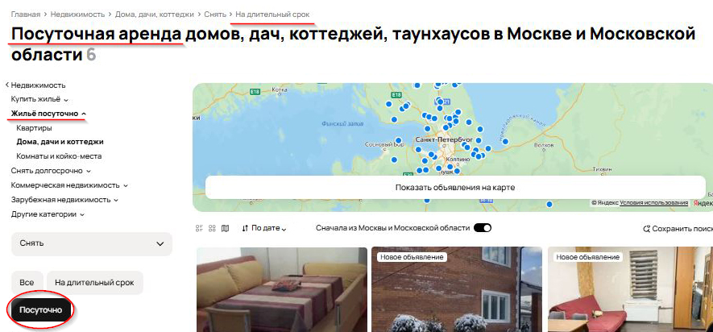

**Шаги воспроизведения**:
1. Перейти в раздел посуточной аренды.
2. Посмотреть текст под логотипом.

**Ожидаемый результат**: Текст отражает текущий режим поиска (посуточная аренда).  
**Фактический результат**: Указано, что выполняется поиск на длительный срок.  
**Приоритет**: Medium

---

### BUG-003: Разное расстояние между карточками

**Описание**: Карточки расположены неравномерно — нарушена вертикальная и горизонтальная сетка.

**Скриншот**:  
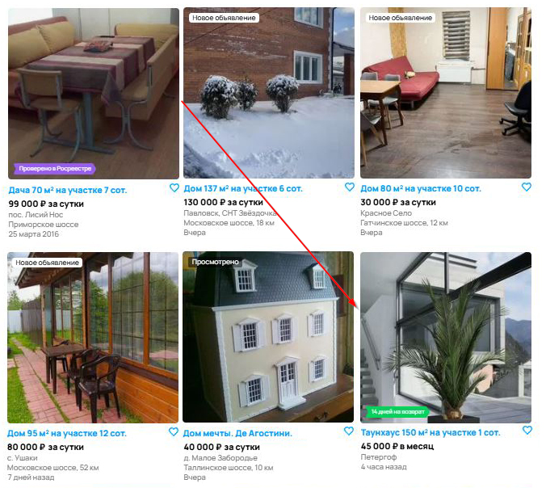

**Шаги воспроизведения**:
1. Открыть страницу с результатами поиска.
2. Прокрутить до нескольких строк карточек.
3. Сравнить отступы между карточками.

**Ожидаемый результат**: Карточки равномерно выровнены в сетке.  
**Фактический результат**: Расстояния между карточками отличаются.  
**Приоритет**: Low

---

### BUG-004: Нет маркировки "Новое объявление" на карточке, опубликованной 4 часа назад

**Описание**: Отсутствует визуальный индикатор нового контента.

**Скриншот**:  
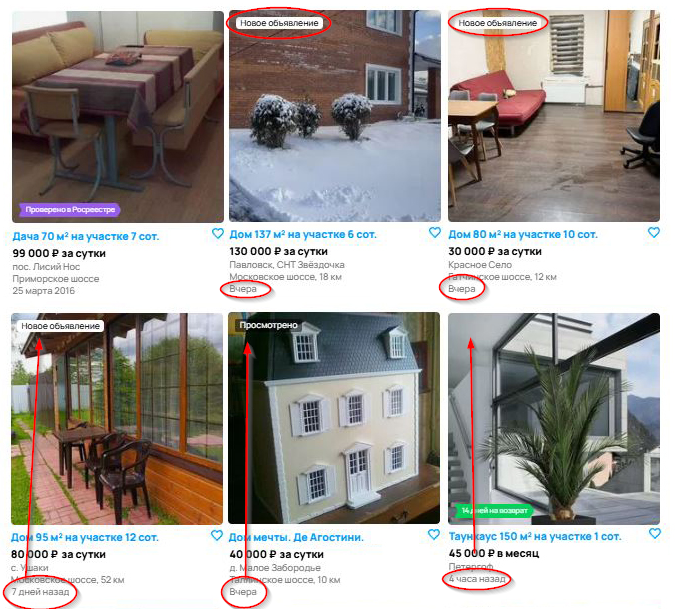

**Шаги воспроизведения**:
1. Найти объявление, опубликованное менее 24 часов назад.
2. Посмотреть наличие пометки "Новое".

**Ожидаемый результат**: У новых объявлений отображается метка "Новое объявление".  
**Фактический результат**: Метка отсутствует.  
**Приоритет**: Low

---

### BUG-017: Текст "Комнаты и койко-места" написан как "Комнаты и коко-места"

**Описание**: Орфографическая ошибка на главной кнопке поиска.

**Скриншот**:  

**Шаги воспроизведения**:
1. Пролистать страницу до футера.
2. Найти раздел "Путешествия".

**Ожидаемый результат**: Кнопка подписана как "Комнаты и койко-места".  
**Фактический результат**: Кнопка подписана как "Комнаты и коко-места".  
**Приоритет**: Low

---

## 🟧 Ошибки фильтрации и поиска

---

### BUG-005: Сообщение "Ничего не найдено" при наличии результатов

**Описание**: Отображается текст "Ничего не найдено", несмотря на наличие карточек выше по странице.

**Скриншот**:  
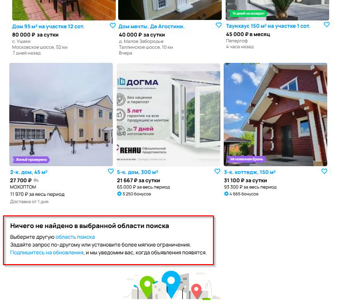

**Шаги воспроизведения**:
1. Перейти на страницу поиска с активными фильтрами.
2. Просмотреть блок с сообщением под результатами.

**Ожидаемый результат**: Сообщение не отображается, если есть результаты.  
**Фактический результат**: Появляется сообщение "Ничего не найдено в выбраноой области поиска" и вводит в заблуждение.  
**Приоритет**: High

---

### BUG-006: Фильтр по цене не работает

**Описание**: Установлен фильтр "Цена за сутки до 50 000 ₽", но отображаются объявления с большей ценой.

**Скриншот**:  
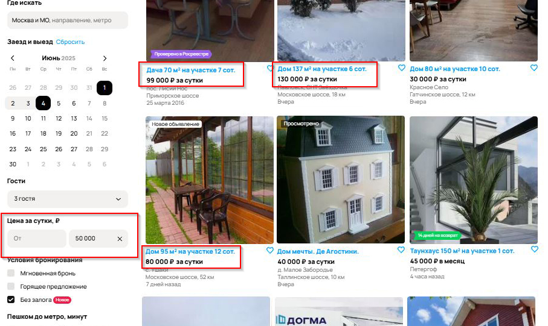

**Шаги воспроизведения**:
1. Установить фильтр: Цена до 50 000 ₽.
2. Просмотреть карточки в результатах поиска.

**Ожидаемый результат**: Все объявления соответствуют фильтру по цене.  
**Фактический результат**: Отображаются объявления с ценой выше фильтра.  
**Приоритет**: High

---

### BUG-007: Фильтр "Где искать" не работает

**Описание**: Установлен фильтр "Москва и МО", но отображаются объявления из Санкт-Петербурга.

**Скриншот**:  
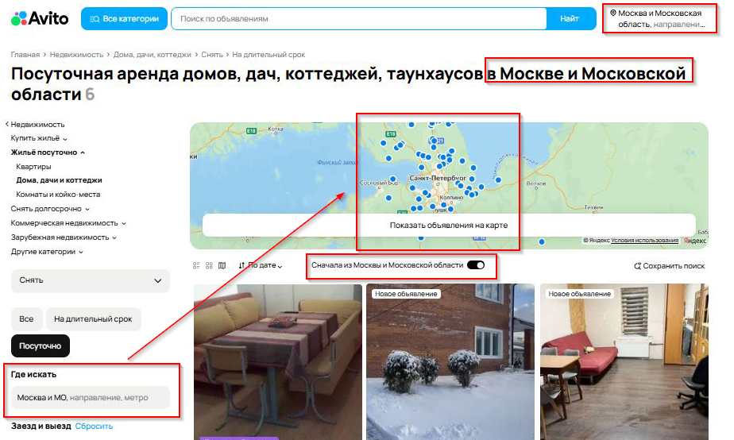

**Шаги воспроизведения**:
1. Установить фильтр "Где искать": Москва и МО.
2. Просмотреть местоположение объектов.

**Ожидаемый результат**: Все объекты из заданного региона.  
**Фактический результат**: Есть объекты из других регионов.  
**Приоритет**: High

---

### BUG-008: Фильтр "Пешком до метро, минут" не работает

**Описание**: Установлен фильтр "до 5 минут", но есть объявления в поселках, СНТ, деревнях.

**Скриншот**:  
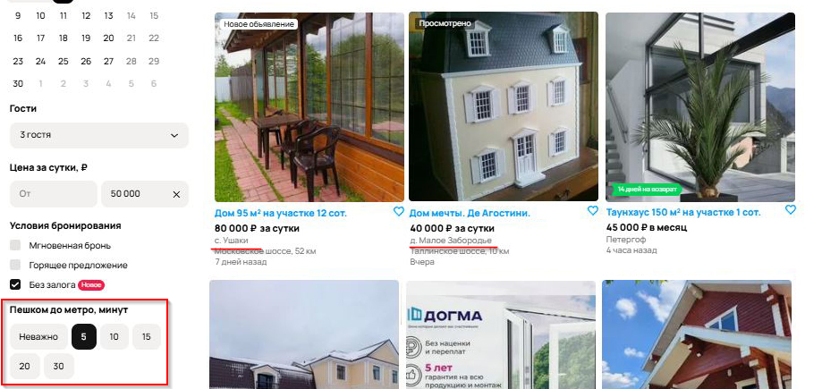

**Шаги воспроизведения**:
1. Установить фильтр "Пешком до метро: до 5 минут".
2. Посмотреть местоположение объявлений.

**Ожидаемый результат**: Все объекты находятся рядом с метро.  
**Фактический результат**: Включены объекты в удалённых населённых пунктах.  
**Приоритет**: High

---

### BUG-009: Сортировка по дате не работает

**Описание**: При выборе "По дате" карточки остаются в произвольном порядке.

**Скриншот**:  
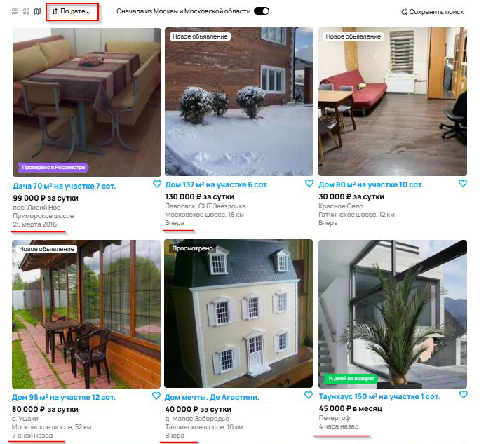

**Шаги воспроизведения**:
1. Установить сортировку "По дате".
2. Проверить порядок карточек.

**Ожидаемый результат**: Объявления упорядочены по дате публикации.  
**Фактический результат**: Порядок не меняется.  
**Приоритет**: Medium

---

### BUG-010: Некорректное количество найденных объявлений

**Описание**: В заголовке отображается "Найдено 6 объявлений", но фактически загружено 4 страницы.

**Скриншот**:  

**Шаги воспроизведения**:
1. Установить фильтры: Недвижимость, жилье посуточно, дома, дачи и коттеджи, снять.
2. Установить фильтр "Где искать": Москва и МО.
3. Установить фильтр "Заезд и выезд": 1-4.06.2025.
4. Установить фильтр "Гости": 3.
5. Установить фильтр "Условия бронирования": Без залога.
6. Установить фильтр "Пешком до метро, минут": 5.
7. Установить фильтр "Парковка": Неважно.
8. Установить фильтр "Правила": Можно с животными.
9. Сравнить цифру в заголовке и количество результатов.

**Ожидаемый результат**: Указано реальное количество объявлений.  
**Фактический результат**: Объявлений больше, чем указано в заголовке.  
**Приоритет**: Low

---

## 🟨 Ошибки контента и данных

---

### BUG-011: Несогласованность срока аренды

**Описание**: При фильтре "Посуточно" отображаются объявления с ценой "в месяц".

**Скриншот**:  
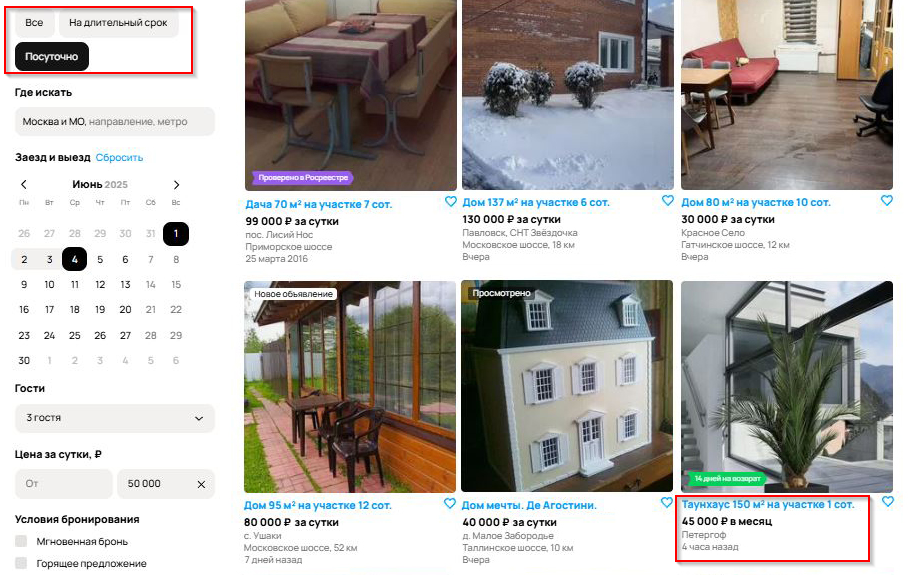

**Шаги воспроизведения**:
1. Выбрать посуточную аренду.
2. Проверить единицы измерения цен.

**Ожидаемый результат**: Все цены указаны "за сутки".  
**Фактический результат**: В некоторых карточках — "в месяц".  
**Приоритет**: Medium

---

### BUG-012: Объявление "Дом мечты. Де Агостини" — кукольный дом, не недвижимость

**Описание**: Игрушка попала в раздел недвижимости.

**Скриншот**:  
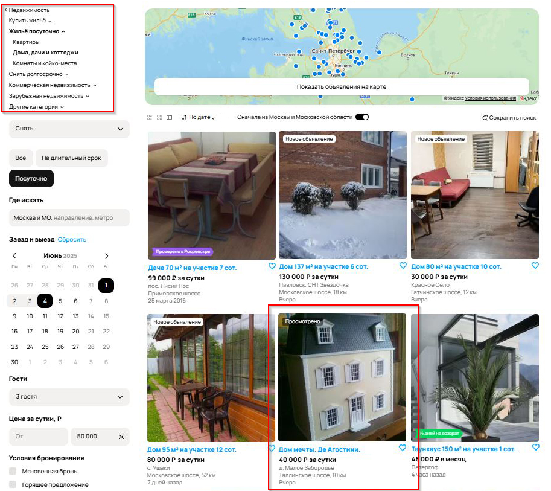

**Шаги воспроизведения**:
Установить фильтры: 
1. Недвижимость, жилье посуточно, дома, дачи и коттеджи, снять.
2. Установить фильтр "Где искать": Москва и МО.
3. Установить фильтр "Заезд и выезд": 1-4.06.2025.
4. Установить фильтр "Гости": 3.
5. Установить фильтр "Условия бронирования": Без залога.
6. Установить фильтр "Пешком до метро, минут": 5.
7. Установить фильтр "Парковка": Неважно.
8. Установить фильтр "Правила": Можно с животными.
9. Пролистать список результатов.
10. Найти объявление "Дом мечты. Де Агостини".

**Ожидаемый результат**: Только реальные объекты недвижимости.  
**Фактический результат**: Присутствует игрушечный домик.  
**Приоритет**: Medium

---

### BUG-013: Нет единого стиля отображения информации

**Описание**: В разных карточках разный набор данных: где-то бонусы, где-то только цена.

**Скриншот**:  
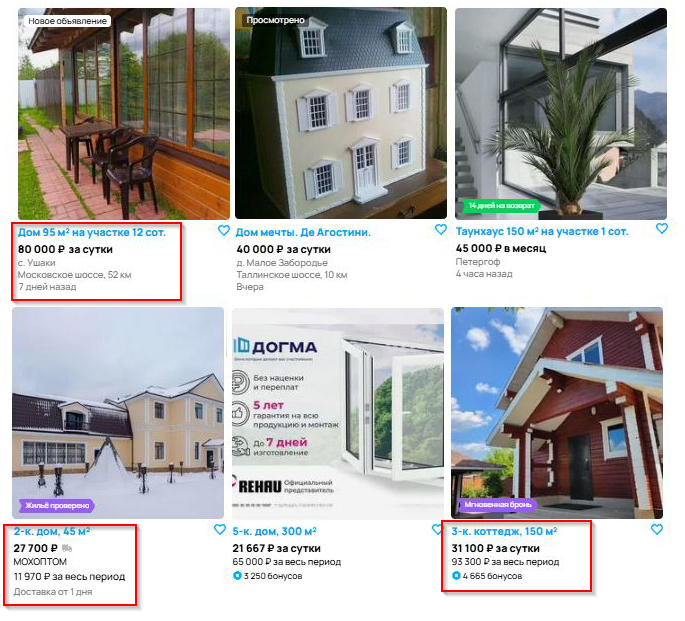

**Шаги воспроизведения**:
1. Сравнить 5–6 подряд идущих объявлений.
2. Обратить внимание на текст под карточками.

**Ожидаемый результат**: Единый формат информации (для посуточной аренды - указан заголовок, адрес, стоимость за сутки, стоимость за выбранный период, дата публикации объявления).  
**Фактический результат**: Карточки отличаются по структуре.  
**Приоритет**: Medium

---

### BUG-014: В объявлении с недвижимостью указана возможность доставки

**Описание**: Для недвижимости не может быть опции доставки, это не товар.

**Скриншот**:  
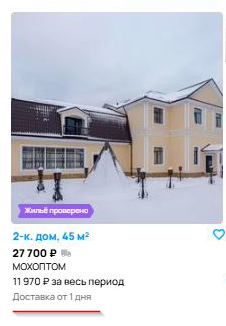

**Шаги воспроизведения**:
1. Недвижимость, жилье посуточно, дома, дачи и коттеджи, снять.
2. Установить фильтр "Где искать": Москва и МО.
3. Установить фильтр "Заезд и выезд": 1-4.06.2025.
4. Установить фильтр "Гости": 3.
5. Установить фильтр "Условия бронирования": Без залога.
6. Установить фильтр "Пешком до метро, минут": 5.
7. Установить фильтр "Парковка": Неважно.
8. Установить фильтр "Правила": Можно с животными.
9. Пролистать список результатов.
10. Найти объявление с информацией о доставке.

**Ожидаемый результат**: Отсутствие информация о доствке для недвижимости.  
**Фактический результат**: Указана информация и сроках доставки.  
**Приоритет**: Medium

---

### BUG-015: В объявлении указана возможность возврата

**Описание**: Для недвижимости не может быть опции возврата.

**Скриншот**:  

**Шаги воспроизведения**:
1. Недвижимость, жилье посуточно, дома, дачи и коттеджи, снять.
2. Установить фильтр "Где искать": Москва и МО.
3. Установить фильтр "Заезд и выезд": 1-4.06.2025.
4. Установить фильтр "Гости": 3.
5. Установить фильтр "Условия бронирования": Без залога.
6. Установить фильтр "Пешком до метро, минут": 5.
7. Установить фильтр "Парковка": Неважно.
8. Установить фильтр "Правила": Можно с животными.
9. Пролистать список результатов.
10. Найти объявление с информацией о возврате.

**Ожидаемый результат**: Отсутствие информация о сроках возврата для недвижимости.  
**Фактический результат**: Указана информация и сроках возврата.  
**Приоритет**: Medium

---

### BUG-016: Объявление содержит рекламу окон вместо фото объекта

**Описание**: Вместо фото недвижимости — рекламный баннер.

**Скриншот**:  

**Шаги воспроизведения**:
1. Недвижимость, жилье посуточно, дома, дачи и коттеджи, снять.
2. Установить фильтр "Где искать": Москва и МО.
3. Установить фильтр "Заезд и выезд": 1-4.06.2025.
4. Установить фильтр "Гости": 3.
5. Установить фильтр "Условия бронирования": Без залога.
6. Установить фильтр "Пешком до метро, минут": 5.
7. Установить фильтр "Парковка": Неважно.
8. Установить фильтр "Правила": Можно с животными.
9. Пролистать список результатов.
10. Найти объявление с рекламой.

**Ожидаемый результат**: Изображение объекта недвижимости.  
**Фактический результат**: Реклама окон.  
**Приоритет**: Low  