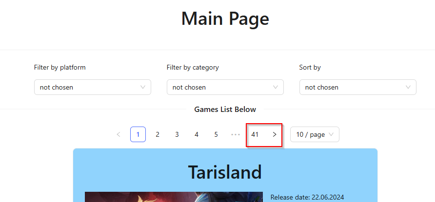
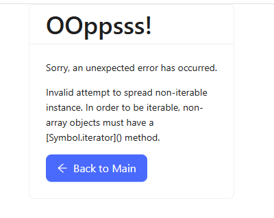
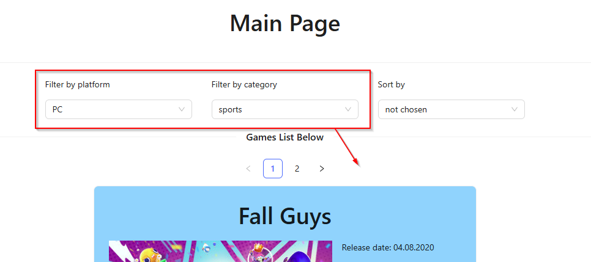
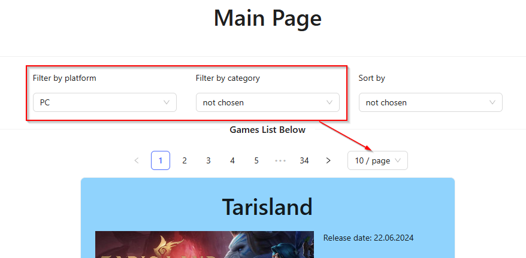
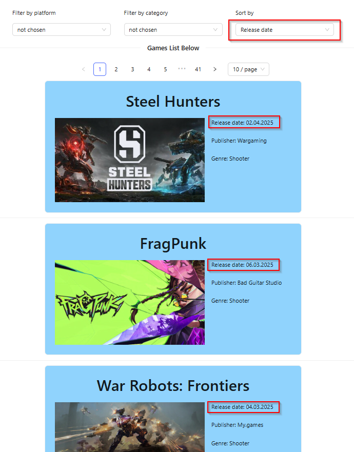

# Найденные баги на странице сборника игр по разным жанрам

### BUG-001: Не работает переход на последнюю страницу пагинации

**Описание**: 
При попытке выбрать последнюю страницу пагинации (например, страницу с номером 41) переход не происходит, и остаётся текущая загруженная страница.

**Скриншот**:  

**Входные условия**:
- Main page: https://makarovartem.github.io/frontend-avito-tech-test-assignment/
- Пагинация загружена и отображает несколько страниц.
- Используемый браузер: Google Chrome (версия 132.0.6834.159).

**Шаги воспроизведения**:
1. Открыть Main page.
2. Перейти на 41 страницу пагинации.

**Ожидаемый результат**: 
Переход на 41-ю страницу осуществляется корректно, и отображаются соответствующие карточки игр. 

**Фактический результат**: 
Переход не выполняется – остаётся текущая страница. 

**Приоритет**: High

### BUG-002: Ошибка при попытке обнулить фильтр

**Описание**:
При переводе выбранного фильтра обратно в состояние "not chosen" появляется сообщение об ошибке.

**Скриншот**:  

**Входные условия**:
- Main page: https://makarovartem.github.io/frontend-avito-tech-test-assignment/
- Используемый браузер: Google Chrome (версия 132.0.6834.159).

**Шаги воспроизведения**:
1. Открыть Main page.
2. В фильтре *Filter by platform* выбрать категорию "Browser"
3. Затем перевести фильтр обратно в состояние "not chosen".

**Ожидаемый результат**:
Фильтрация сбрасывается, и отображаются все карточки игр.

**Фактический результат**:
Появляется сообщение об ошибке:  
*"Sorry, an unexpected error has occurred. Invalid attempt to spread non-iterable instance. In order to be iterable, non-array objects must have a [Symbol.iterator]() method."*

**Приоритет**: High

### BUG-003: Пропадает возможность выбора количества карточек на странице

**Описание**:
При выборе фильтров иногда пропадает возможность изменить количество карточек, отображаемых на странице. Проблема проявляется не во всех комбинациях фильтров — при выборе одних значений функционал остается, а при других исчезает.

**Скриншот**:  

**Входные условия**:
- Main page: https://makarovartem.github.io/frontend-avito-tech-test-assignment/
- Используемый браузер: Google Chrome (версия 132.0.6834.159).

**Шаги воспроизведения**:
1. Открыть Main page.
2. В фильтре *Filter by platform* выбрать категорию "PC"
3. В фильтре *Filter by category* выбрать категорию "sports"

**Ожидаемый результат**:
Вне зависимости от выбранных фильтров сохраняется возможность выбрать количество карточек на странице.

**Фактический результат**:
Фильтр, позволяющий выбрать количество карточек, исчезает.

**Примечание**:
При выборе в фильтре *Filter by category* категорий "moba", "racing", "sports", "social" в сочетании с выбором "not chosen" в фильтре *Filter by platform*, возможность выбора количества карточек также пропадает.

**Приоритет**: Medium

### BUG-004: Не работает сортировка

**Описание**:
Сортировка карточек игр по дате релиза работает некорректно – порядок карточек остается произвольным.

**Скриншот**:  

**Входные условия**:
- Main page: https://makarovartem.github.io/frontend-avito-tech-test-assignment/
- Используемый браузер: Google Chrome (версия 132.0.6834.159).

**Шаги воспроизведения**:
1. Открыть Main page.
2. В фильтре *Sort by* выбрать категорию "Release date"

**Ожидаемый результат**:
Карточки игр сортируются по дате релиза в правильном порядке.

**Фактический результат**:
Карточки расположены в произвольном порядке.

**Приоритет**: Medium

